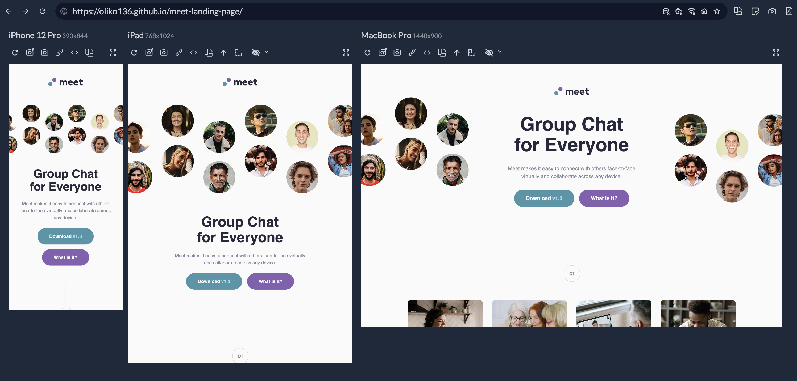
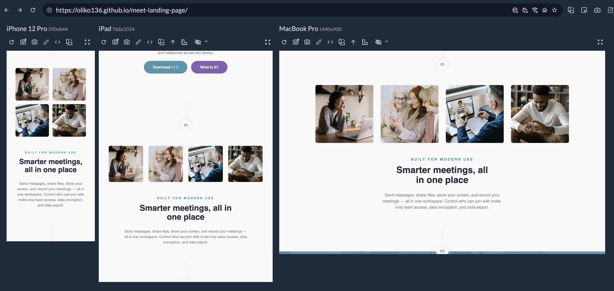

# Frontend Mentor - Meet landing page solution

This is a solution to the [Meet landing page challenge on Frontend Mentor](https://www.frontendmentor.io/challenges/meet-landing-page-rbTDS6OUR). Frontend Mentor challenges help you improve your coding skills by building realistic projects.

## Table of contents

- [Overview](#overview)
  - [The challenge](#the-challenge)
  - [Screenshot](#screenshot)
  - [Links](#links)
- [My process](#my-process)
  - [Built with](#built-with)
  - [What I learned](#what-i-learned)
- [Author](#author)

## Overview

### The challenge

Users should be able to:

- View the optimal layout depending on their device's screen size
- See hover states for interactive elements

### Screenshot

### Links

- Solution URL: [https://github.com/Oliko136/meet-landing-page](https://github.com/Oliko136/meet-landing-page)
- Live Site URL: [https://oliko136.github.io/meet-landing-page/](https://oliko136.github.io/meet-landing-page/)

## My process

### Built with

- Semantic HTML5 markup
- CSS custom properties
- Flexbox
- CSS Grid
- Mobile-first workflow

### What I learned

Use this section to recap over some of your major learnings while working through this project. Writing these out and providing code samples of areas you want to highlight is a great way to reinforce your own knowledge.

## Author

- LinkedIn - [@olha-sliusarenko](https://www.linkedin.com/in/olha-sliusarenko/)
- X - [@committedto_git](https://x.com/committedto_git)
- Instagram - [@committedto_git](https://www.instagram.com/committedto_git/)
- Frontend Mentor - [@Oliko136](https://www.frontendmentor.io/profile/Oliko136)
